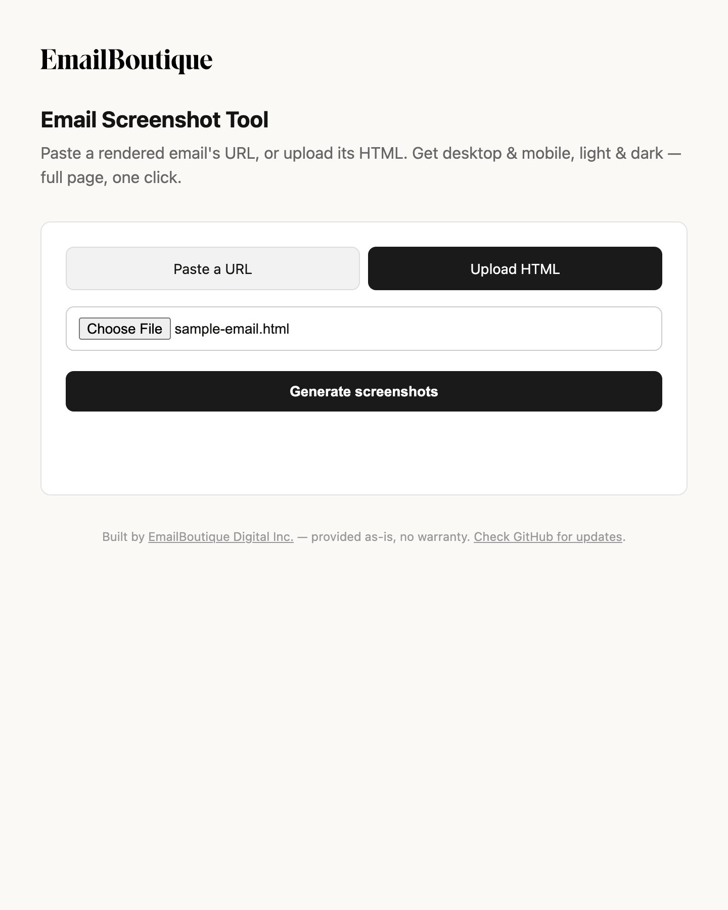

# Email Screenshot Tool

Built by [EmailBoutique Digital Inc.](https://emailboutique.io) ·
[GitHub repo](https://github.com/Annett/email-screenshot-tool) for the latest
version and updates.

Paste a rendered email's URL, or upload its HTML file, and get four full-page
screenshots in one click: desktop/mobile × light/dark mode. No scrolling, no
manual stitching, no DevTools required — great for building out a portfolio
or case study fast.



## How it works

The server (`server.js`) drives a real headless Chrome via
[Puppeteer](https://pptr.dev):

1. It opens your URL, or renders your uploaded HTML directly
   (`page.setContent`), in a fresh page per screenshot.
2. It emulates the `prefers-color-scheme` media feature
   (`page.emulateMediaFeatures`) to force true light or dark rendering —
   the same mechanism email clients and OSes use, so your email's `@media
   (prefers-color-scheme: dark)` CSS fires exactly as it would for a
   real reader.
3. It sets the viewport to a desktop (700px) or mobile (390px) width, waits
   briefly for webfonts/images to settle, then captures the *entire*
   scrollable page as one PNG (`fullPage: true`) — however long the email
   is, no stitching required.

That's four screenshots — desktop/light, desktop/dark, mobile/light,
mobile/dark — defined in the `VARIANTS` array at the top of `server.js`.

Each thumbnail is a real downloadable PNG, and **Download all (.zip)**
bundles all four into one file via [archiver](https://www.npmjs.com/package/archiver).

## API

Two endpoints, if you want to script against it instead of using the UI:

- `POST /generate` — multipart form with either a `url` field or an
  `htmlFile` field (not both). Returns `{ jobId, images: { <variant>: {
  label, href } } }`. Screenshots are written to `output/` and served at
  `href`.
- `GET /download-all/:jobId` — streams a zip of that job's four PNGs.

## Requirements

- Node.js 18+

## Setup

```bash
npm install
npm start
```

Then open **http://localhost:4747** in your browser.

## Use

1. Either paste the URL of any rendered email (from your ESP, CMS, or
   wherever it's hosted), or switch to the "Upload HTML" tab and pick a
   `.html` file.
2. Click **Generate screenshots**.
3. Download the four PNGs individually — Desktop · Light, Desktop · Dark,
   Mobile · Light, Mobile · Dark — or click **Download all (.zip)** to get
   all four in one file.

Screenshots are saved locally to `output/` (gitignored) and served back to
the browser for download — nothing leaves your machine.

## Configuration

- **Viewport widths**: desktop 700px, mobile 390px. Change the `VARIANTS`
  array in `server.js` if you want different breakpoints, or add more
  variants entirely (e.g. a tablet width).
- **Port**: defaults to `4747`. Override with `PORT=<number> npm start`.

## Troubleshooting

- **"This site can't be reached"** — the server isn't running, or crashed.
  Run `npm start` again in the project folder and leave that terminal
  window open while you use the tool.
- **`Error: listen EADDRINUSE: address already in use :::4747`** — something
  is already listening on port 4747 (maybe an earlier `npm start`). Find and
  stop it: `lsof -nP -iTCP:4747 -sTCP:LISTEN`, then `kill <PID>` from the
  output, and run `npm start` again.
- **`Connection closed` error when generating** — this means the
  server's cached headless-Chrome connection died (for example, after a
  dependency reinstall while the server was still running from before it).
  Stop the server (`Ctrl+C`) and start it fresh with `npm start`.
- **Nothing happens after clicking "Generate screenshots"** — check the
  terminal running `npm start` for errors; the page's status line will also
  show the specific failure (e.g. an invalid URL, or a page that timed out
  loading).

## Disclaimer

This is an internal EmailBoutique tool, shared as-is under the MIT license
(see `LICENSE`) — no warranty, no guarantee of fitness for any particular
purpose, and no ongoing support commitment. In particular:

- It is a **local tool, not a hosted service**. It will fetch whatever URL or
  render whatever HTML you give it, with no sandboxing beyond what
  Puppeteer/Chrome do by default. Don't point it at untrusted HTML/URLs.
- **Do not deploy this as-is on the public internet.** Doing so exposes an
  open door for someone to point it at internal/malicious URLs (SSRF) or
  exhaust resources by spamming requests (each one spins up a real headless
  Chrome instance). Add authentication, rate limiting, and URL validation
  first if you host it anywhere reachable by others.
- Screenshot accuracy depends on Puppeteer's bundled Chromium. It's a close,
  practical approximation of how a given client renders dark mode — not a
  substitute for testing in actual email clients (Apple Mail, Gmail, Outlook,
  etc.) before a real send.

## License

MIT — see [LICENSE](LICENSE).
